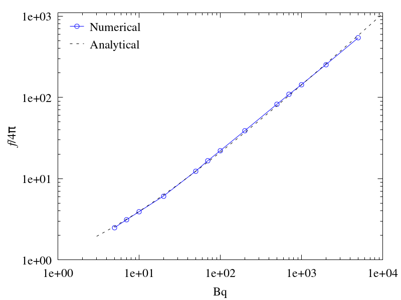

# iRheoFoam

An open-source package for the numerical simulation of the rheological behavior of complex interfaces, developed in OpenFOAM. 

It is based on the Boussinesq-Scriven interface constitutive model and incorporates various solvers for both transient and steady problems. The package permits considering the presence of solid objects placed at the interface and coupling the latter to bulk phases. It has been developed in the OpenFOAM framework and allows for a straightforward implementation of new interface models and solvers, making it a versatile and powerful tool in the field of computational rheology. The main application goal of the package is the numerical simulation of the flow around objects, such as probes, immersed at a complex interface, reproducing given experimental conditions. For this type of problem, several test cases have been performed to validate the package by comparing the results obtained with analytical solutions and numerical and experimental results available in the literature.

## Requirements
The package has been developed using OpenFOAM-v2306. However, it has been successfully tested on more recent versions of OpenFOAM. To install version v2306 and other versions, follow the instructions available at:

https://develop.openfoam.com/Development/openfoam/-/wikis/precompiled

## Installation
0. Source your OpenFOAM environment

1. Download the package with git by typing on a terminal:
```
git clone https://github.com/iRheoFoam/iRheoFoam.git
```

2.  Run the Allwmake script by typing:
```
cd iRheoFoam
./Allwmake
```

Solvers and utilities will be compiled to `$FOAM_USER_APPBIN` directory and libraries will be compiled to `$FOAM_USER_LIBBIN` directory.

## Code structure
`src/`
* `postProcessing/rheoForces/`
	* Function object that calculates the force originated by the flow on the interface and the bulk at specified boundaries.
* `iRheo/boundaryConditions/`
	* Boundary conditions for coupling bulk and interface flows.
* `iRheo/interfaceModels/`
	* Class used to implement interfacial constitutive models. At the moment, the available models are Boussinesq-Scriven model and one modified to include extensional viscosity.
* `iRheo/isothermModels/`
	* Class used to implement isotherm models for the calculation of the Marangoni modulus. The available models are ideal gas, Langmuir, Volmer, Frumkin, van der Waals, and 'experimental'. See the source code for a deatiled description of each one and their usage.
* `iRheo/movingFaMesh/`
	* Class used to calculate fluxes due to mesh motion at the edges of the surface mesh.
* `iRheo/rheoResiduals/`
	* Class used to calculate the normalized values of the interface velocity and surfactant concentration and check their convergence.
* `iRheo/pimpleControlRheo/`
	* Slight modification of the original class `pimpleControl` for loop control issues.
* `iRheo/CorrectPhiRheo/`
	* Slight modification of the original class `CorrectPhi` to use the new class `pimpleControlRheo`.

`applications`
- `solvers/simpleRheoFoam/`
	- Solver for the simulation of steady-state problems. It uses the SIMPLE algorithm to solve the Navier-Stokes equations governing the flow in the bulk. Based on the original `simpleFoam` solver.
- `solvers/pimpleRheoFoam/`
	- Solver for the simulation of transient problems. It uses the PIMPLE/PISO algorithm to solve the Navier-Stokes equations governing the flow in the bulk. Based on the original `pimpleFoam` solver.

`run/`
- `disc/`
	 - Test problem to simulate the flow around a disc placed at a planar interface moving with constant velocity.
- `pourali/`
	 - Test problem to simulate the flow around a spherical particle placed at a planar interface moving with constant velocity. Test taken from [Pourali et al. (2021)](https://doi.org/10.1063/5.0050936).
- `verwijlen/`
	 - Test problem to simulate the flow originated in the CIT device. Test taken from [Verwijlen et al. (2012)](http://dx.doi.org/10.1122/1.4733717).

## Results
Scripts for generating (`Allrun.pre`), running (`Allrun`), and postprocessing (`Allrun.post`) the test cases are provided in each test directory. 

Inside the `data` directory of each test directory are the gnuplot scripts and the simulation data to generate the figures. 

For instance, in the disc test, the drag coefficient as a function of Bq is obtained numerically and compared to an analytical expression (see Eq. 4.156 in [Manikantan and Squires (2020)](https://doi.org/10.1017/jfm.2020.170)). The following figure shows this comparision:

<p align="center"> 

</p>

## Numerical settings
Typical values of the parameters of the numerical model are given below, grouped according to the dictionary in which they appear:

`system/faSolution`, subdictionary `solution`
- `iterations`: number of inner iterations, $N_\mathrm{iter}$, used in the solution of the model equations (bulk and interface equations). We use $N_\mathrm{iter} = 100$, which has been found to ensure the convergence of the results. However, larger values may improve the convergence for certain combinations of parameters, such as high Ma and $\Theta$.
- `tolerance`: tolerance, $\varepsilon$, for the difference between the normalized average values of $u_s$ and $\Gamma$ of two consecutive iterations. We set $\varepsilon =10^{-6}$, although smaller values can be used but at the cost of increased computational time (depending on $N_\mathrm{iter}$) without a noticeable improvement in accuracy, specially in the early instants of the simulation.
- `wGamma`: weight, $w_\Gamma$, assigned to the interpolated values of $\Gamma$ in the smoothing procedure. For the tests performed, we found that $w_\Gamma = 0.1$ allows us to avoid oscillations without increasing the solution error.
- `nGamma`: number of iterations, $N_\Gamma$, of the smoothing procedure of $\Gamma$. We set $N_\Gamma = 1$.

`system/faSolution`, subdictionary `relaxationFactors`:
 - `Us`: the relaxation factor for $\mathbf u_{s}$ has to be $\alpha_{\mathbf{u}_s}\sim \mathcal{O}(\Theta^{-1})$ to allow the resolution of the assembled system of equations corresponding to the interfacial stress balance equation.
 - `gamma`: for the $\Gamma$ field, we use a value of the relaxation factor of 1. Lower values do not affect the final solution.

`system/fvSolution`, subdictionary `PIMPLE`:
 - `nOuterCorrectors`: used in `pimpleRheoFoam`. It corresponds to $N_\mathrm{iter}$.

`system/fvSolution`, subdictionary `relaxationFactors`:
 - `U`: when the interface is coupled to a bulk phase, we use a relaxation factor of 0.8.
 - `p`: we use a relaxation factor of 0.7.
  
`system/controlDict`
- `maxCo`: corresponds to the maximum CFL number. For the performed tests, we recommend CFL values between $10^{-2}$ and $10^{-4}$ to avoid numerical instabilities.
- `maxDeltaT`: the maximum time-step has to be  $\Delta \tilde{t}_{\max} < \min \left[\min \left(\frac{1}{\mathrm{Ma}}, \mathrm{Pe}_s \right), 1 \right]$.

## Notes
To facilitate code readability, the mathematical model has been implemented using dimensionless equations. However, to avoid inconsistencies in the solvers, dimensions for the p, U, and Us fields are required in the directory `0` of the run tests.

## Reference
Further details on the implementation and validation of the package can be found in

